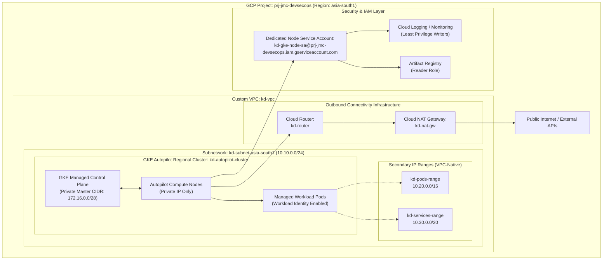

# GKE Autopilot Infrastructure Design & Implementation Document

**Document Version:** 1.0.0  
**Project ID:** `prj-jmc-devsecops`  
**Target Region:** `asia-south1` (Mumbai, India)  
**Resource Prefix:** `kd`  
**Deployment Model:** Google Kubernetes Engine (GKE) Autopilot with Modular Terraform

---

## 1. Executive Summary & Architecture Overview

This document defines the architectural design, security framework, least-privilege IAM model, cost analysis, and implementation plan for deploying an enterprise-ready **Google Kubernetes Engine (GKE) Autopilot** cluster and supporting VPC networking in Google Cloud Platform (GCP).

All resources adhere to the project prefix `kd-` and are deployed within the `asia-south1` (Mumbai) region for data residency, low latency, and operational compliance.

### Architecture Diagram



---

## 2. Environment & Specification Matrix

| Parameter | Specification | Description / Value |
| :--- | :--- | :--- |
| **GCP Project ID** | Target Host Project | `prj-jmc-devsecops` |
| **GCP Region** | Regional Multi-Zone | `asia-south1` (Mumbai, Zones `a`, `b`, `c`) |
| **Naming Prefix** | Consistent Resource Tag | `kd` (e.g., `kd-vpc`, `kd-subnet-asia-south1`, `kd-autopilot-cluster`) |
| **Cluster Mode** | GKE Mode | **Autopilot** (Fully managed nodes, autoscaling, security hardening) |
| **Release Channel** | Control Plane & Worker Lifecycle | `REGULAR` (Configurable: `STABLE` / `RAPID`) |
| **Network Architecture** | VPC Model | Custom-mode VPC with VPC-native Alias IP secondary ranges |
| **Node Isolation** | Private GKE Cluster | Enabled (`enable_private_nodes = true`, no public IPs on nodes) |
| **Control Plane Endpoint** | Cluster Master Access | Public/Private Access with Authorized Networks protection |

---

## 3. Network Architecture & IP Allocation Plan

GKE Autopilot enforces **VPC-native traffic routing** using alias IP ranges for Pods and Services.

| Network Entity | Resource Name | CIDR Block | Usable Capacity | Purpose |
| :--- | :--- | :--- | :--- | :--- |
| **Primary Subnet** | `kd-subnet-asia-south1` | `10.10.0.0/24` | 251 host IPs | Subnet interface for GKE node VMs |
| **Secondary Pods CIDR** | `kd-pods-range` | `10.20.0.0/16` | 65,536 IPs | IP addresses allocated directly to Kubernetes Pods |
| **Secondary Services CIDR** | `kd-services-range` | `10.30.0.0/20` | 4,096 IPs | Internal ClusterIP Kubernetes Services |
| **Master Management CIDR** | Managed by Google | `172.16.0.0/28` | 16 IPs | Isolated peering CIDR for GKE Control Plane |

---

## 4. Least-Privilege IAM Security Model

### 4.1 Terraform Provisioning Identity (Admin / CI/CD Pipeline)

The identity applying the Terraform configuration requires the following predefined roles:

| Role Name | Role ID | Purpose |
| :--- | :--- | :--- |
| **Kubernetes Engine Admin** | `roles/container.admin` | Create, manage, and update GKE Autopilot clusters |
| **Compute Network Admin** | `roles/compute.networkAdmin` | Provision VPC, Subnets, Secondary Ranges, Cloud Router, and Cloud NAT |
| **Service Account Admin** | `roles/iam.serviceAccountAdmin` | Create and configure the dedicated GKE node service account |
| **Service Account User** | `roles/iam.serviceAccountUser` | Authorize GKE to attach the service account to compute instances |
| **Project IAM Admin** | `roles/resourcemanager.projectIamAdmin` | Assign required runtime roles to the node service account |

#### Grant Permissions Command via `gcloud`
```bash
PROJECT_ID="prj-jmc-devsecops"
MEMBER="user:your-email@example.com" # Or "serviceAccount:terraform-sa@prj-jmc-devsecops.iam.gserviceaccount.com"

for ROLE in \
  roles/container.admin \
  roles/compute.networkAdmin \
  roles/iam.serviceAccountAdmin \
  roles/iam.serviceAccountUser \
  roles/resourcemanager.projectIamAdmin; do
  gcloud projects add-iam-policy-binding "$PROJECT_ID" \
    --member="$MEMBER" \
    --role="$ROLE"
done
```

---

### 4.2 GKE Node Runtime Service Account (`kd-gke-node-sa`)

To avoid using the overly permissive default Compute Engine service account (`<project-number>-compute@developer.gserviceaccount.com`), Terraform creates a dedicated service account with the following minimal runtime roles:

| Role Name | Role ID | Justification |
| :--- | :--- | :--- |
| **Logging Log Writer** | `roles/logging.logWriter` | Ingest node, system, and pod logs into Cloud Logging |
| **Monitoring Metric Writer** | `roles/monitoring.metricWriter` | Stream system and cluster telemetry into Cloud Monitoring |
| **Monitoring Viewer** | `roles/monitoring.viewer` | Read monitoring descriptors and cluster telemetry |
| **Stackdriver Resource Metadata Writer** | `roles/stackdriver.resourceMetadata.writer` | Publish container metadata to Cloud Operations |
| **Artifact Registry Reader** | `roles/artifactregistry.reader` | Pull application container images from Google Artifact Registry |

---

## 5. Estimated Cost Breakdown (`asia-south1` - Mumbai)

### 5.1 Itemized Resource Cost Table

| Resource Component | Billing Metric | Unit Rate (`asia-south1`) | Estimated Monthly Cost (POC Baseline) | Notes |
| :--- | :--- | :--- | :--- | :--- |
| **GKE Cluster Management Fee** | Cluster / Hour | $0.10 / hour | **$73.00 / month**<br>*(Net $0.00 with Free Tier)* | GCP provides a **$74.40/month credit** covering 1 cluster per billing account. |
| **GKE Autopilot Compute (Pod vCPU)** | vCPU / Hour | ~$0.0494 / vCPU-hr | **~$36.06 / month** *(for 1 vCPU 24/7)* | Autopilot charges **only** for requested Pod resources, with zero idle node overhead. |
| **GKE Autopilot Memory (Pod RAM)** | GB / Hour | ~$0.0054 / GB-hr | **~$15.77 / month** *(for 4 GB RAM 24/7)* | Billed per GB requested by running Pods. |
| **GKE Autopilot Storage (Ephemeral)** | GB / Hour | ~$0.000055 / GB-hr | **~$0.40 / month** *(for 10 GB)* | Billed for requested ephemeral storage beyond the default quota. |
| **VPC & Subnets (`kd-vpc`, `kd-subnet`)** | Custom Network | $0.00 | **$0.00 (Free)** | Custom VPC, subnets, and secondary IP ranges are free of charge. |
| **Cloud Router (`kd-router`)** | Control Plane | $0.00 | **$0.00 (Free)** | Cloud Router control plane is free. |
| **Cloud NAT Gateway (`kd-nat-gw`)** | Gateway uptime | ~$0.045 / hour | **~$32.85 / month** | Provides outbound egress for private nodes (image pulls, APIs). |
| **Cloud NAT Data Processing** | Outbound traffic | ~$0.045 / GB | **~$2.25 / month** *(for 50 GB egress)* | Charges apply only to outbound data passing through NAT. |
| **Cloud Logging & Monitoring** | Logs & Metrics | Free tier included | **$0.00 - $2.00 / month** | First 50 GB logs and 150 MB metrics free per month. |
| **IAM & Service Account (`kd-gke-node-sa`)** | Service Account | $0.00 | **$0.00 (Free)** | Service accounts and IAM policy bindings are free. |

### 5.2 Summary Monthly Cost Scenarios

| Scenario | Estimated Monthly Total (USD) | Remarks |
| :--- | :--- | :--- |
| **1. Idle Cluster (with Free Tier credit + Cloud NAT)** | **~$35.10 / month** | Only Cloud NAT and minimal egress data. |
| **2. Typical POC (2 vCPU, 4GB RAM + Cloud NAT)** | **~$87.00 – $122.00 / month** | Suitable for testing devsecops workloads. |
| **3. POC using GKE Spot Pods** | **~$50.00 – $65.00 / month** | 60–70% discount on Pod compute & memory rates. |

---

## 6. Standard Code File Structure

```text
f:/CLS/gke-poc/
├── main.tf                      # Root module orchestrator (calls modules/vpc, modules/iam, modules/gke)
├── variables.tf                 # Global input variables (project_id, region, prefix, cidrs)
├── outputs.tf                   # Root outputs (cluster endpoint, ca certificate, connection command)
├── versions.tf                  # Terraform version (>= 1.5.0) & Google provider constraints (>= 5.0)
├── terraform.tfvars             # Active environment configuration values
├── terraform.tfvars.example     # Reference template for team members
├── backend.tf.example           # GCS remote state backend configuration template
├── design.md                    # Architecture, design, IAM, cost breakdown, and runbook
├── README.md                    # Quickstart guide and repository documentation
│
└── modules/
    ├── vpc/                     # Networking Module
    │   ├── main.tf              # VPC, Subnet, Secondary CIDRs, Cloud Router & Cloud NAT
    │   ├── variables.tf         # Subnet CIDR, Pod CIDR, Service CIDR, Prefix, Region
    │   └── outputs.tf           # Network self-link, Subnet self-link, Secondary range names
    │
    ├── iam/                     # IAM & Least-Privilege Security Module
    │   ├── main.tf              # Dedicated GKE Node Service Account & minimal IAM role bindings
    │   ├── variables.tf         # Project ID, Service Account ID, Display Name
    │   └── outputs.tf           # Service Account email & unique ID
    │
    └── gke/                     # GKE Autopilot Cluster Module
        ├── main.tf              # Regional GKE Autopilot Cluster (VPC-native, Private Nodes)
        ├── variables.tf         # Cluster name, release channel, network links, SA email, master CIDR
        └── outputs.tf           # Cluster name, endpoint, CA cert, cluster ID
```

---

## 7. Implementation & Deployment Plan

### Step 1: Pre-Deployment Verification
Ensure `gcloud` CLI is authenticated and configured to the target project:
```bash
gcloud auth login
gcloud config set project prj-jmc-devsecops
```

Enable required Google Cloud APIs:
```bash
gcloud services enable \
  container.googleapis.com \
  compute.googleapis.com \
  iam.googleapis.com \
  logging.googleapis.com \
  monitoring.googleapis.com \
  artifactregistry.googleapis.com
```

### Step 2: Initialize Terraform
```bash
terraform init
```

### Step 3: Review Execution Plan
```bash
terraform plan
```

### Step 4: Apply Infrastructure
```bash
terraform apply
```

### Step 5: Post-Deployment Cluster Verification
Retrieve cluster credentials and test connectivity:
```bash
gcloud container clusters get-credentials kd-autopilot-cluster \
  --region asia-south1 \
  --project prj-jmc-devsecops

kubectl get nodes -o wide
kubectl get namespaces
```
